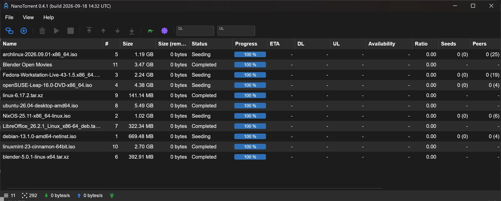
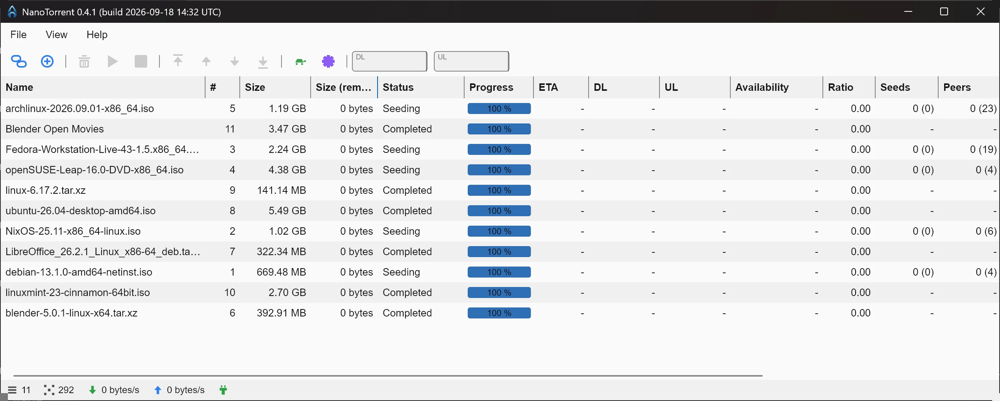
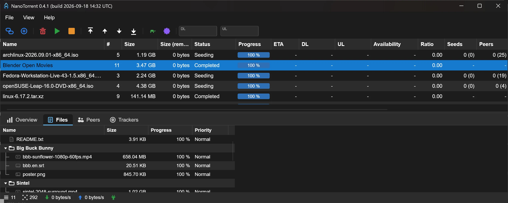
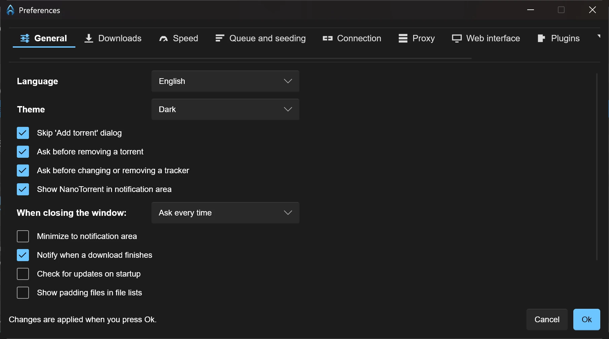
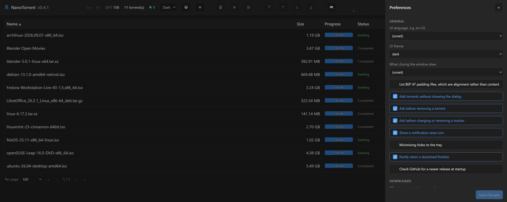
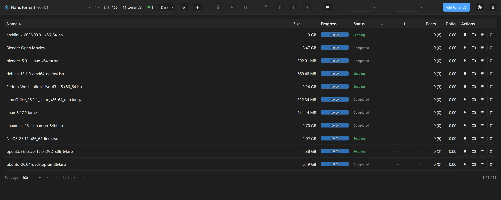
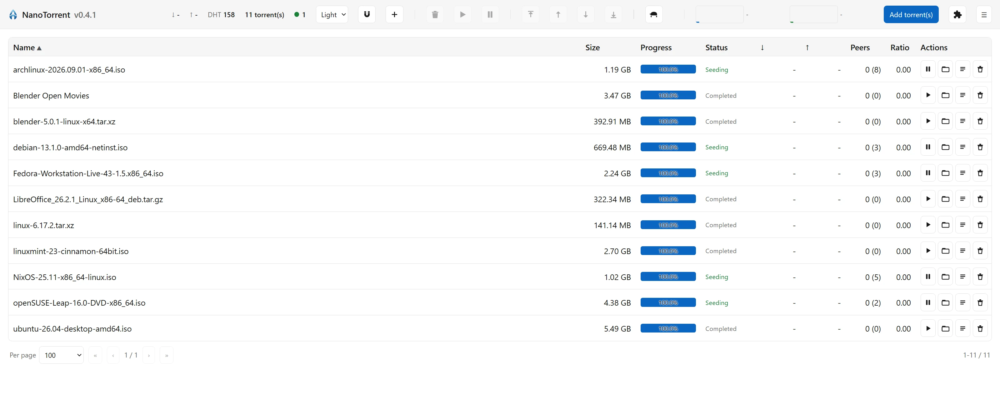

# NanoTorrent

NanoTorrent is a tiny, hackable BitTorrent client for **Windows, Linux and
macOS** — a Rust 2024 port of
[PicoTorrent](https://github.com/picotorrent/picotorrent) by Viktor Elofsson.
It keeps the original's application structure, settings database and behaviour
while replacing the C++ / Rasterbar-libtorrent / wxWidgets stack with pure-Rust
building blocks.

Site: <https://www.nanotorrent.org>

> This port is built predominantly with AI assistance under human review — see
> [AI-DECLARATION.md](AI-DECLARATION.md).

| Aspect                | PicoTorrent (C++)               | NanoTorrent (Rust)                                   |
| --------------------- | ------------------------------- | ---------------------------------------------------- |
| BitTorrent engine     | Rasterbar-libtorrent            | [librqbit](https://crates.io/crates/librqbit) (vendored + patched) |
| GUI                   | wxWidgets (native Win32)        | [Slint](https://slint.dev) — one window on all three platforms |
| Platforms             | Windows                         | Windows, Linux, macOS (plus a headless build)        |
| Settings storage      | SQLite (`PicoTorrent.sqlite`)   | Same schema (`NanoTorrent.sqlite`)                   |
| Resume data           | libtorrent resume blobs in DB   | librqbit session persistence (JSON + `.bitv` mmap)   |
| Translations          | `lang/*.json` embedded in a DB  | Same `lang/*.json` compiled into the executable      |
| Single instance / IPC | Win32 mutex + `WM_COPYDATA`     | Loopback TCP on port 37549                           |
| Notifications         | tray balloons                   | Windows 11 WinRT toasts, plus in-app toasts everywhere |
| Remote access         | —                               | Optional authenticated HTTPS web interface           |
| Logging               | boost::log to file              | `tracing` to file                                    |

On first run NanoTorrent does a one-time copy of an existing
`%LOCALAPPDATA%\PicoTorrent` data folder (settings + session state) into
`%LOCALAPPDATA%\NanoTorrent`, leaving the original untouched.

## Screenshots



The torrent list, the icon toolbar, and the details panel below it. Everything
here is drawn by Slint, so it is the same window on Windows, Linux and macOS.

|  |  |
| --- | --- |
|  |  |
| **Light theme.** Follows the OS by default, or is pinned in Preferences. The toolbar glyphs are drawn rather than shipped as images, so one set works on both. | **Details ▸ Files.** Per-file size, progress and an include toggle, as a tree for multi-file torrents. Peers and Trackers sit beside it. |
|  |  |
| **Preferences.** Six tabs, applied live on OK - the session is rebuilt rather than requiring a restart. | **The same settings, remotely.** The web interface's drawer is generated from the command line's settings registry, so all three surfaces share one list and one validator. |
|  |  |
| **Web interface.** An authenticated HTTPS remote: add, watch, pause, resume, remove, set a location. | **It follows the theme too**, and renders in the configured language. |

<sub>The torrents shown are Linux distribution images, used as sample data.</sub>

## Installing

Download an installer from [Releases](https://github.com/Power2All/nanotorrent/releases),
or build one yourself:

| Platform | File | Built by |
| --- | --- | --- |
| Windows | `NanoTorrent-<ver>-Setup.exe` | NSIS, UPX-compressed payload — `installer/build-installer.bat` |
| Debian / Ubuntu | `nanotorrent-<ver>.deb` | `cargo deb` |
| Fedora / RHEL / openSUSE | `nanotorrent-<ver>.rpm` | `cargo generate-rpm` |
| Any Linux (glibc 2.35+) | `nanotorrent-<ver>-x86_64.AppImage` | `linuxdeploy` — one file, no install |
| macOS | `nanotorrent-<ver>.dmg` | `hdiutil`, from a hand-assembled `.app` |

There is also an **MSIX** for the Microsoft Store — `installeruild-msix.ps1`
builds it, and a GitHub release can publish it automatically. See
[docs/MICROSOFT-STORE.md](docs/MICROSOFT-STORE.md), which also covers what
changes when the app runs packaged.

The macOS bundle is unsigned and unnotarised, so Gatekeeper asks on first
launch (right-click ▸ Open). The Linux packages install the binary, a desktop
entry and an icon; the `.deb` targets glibc 2.35 or newer (Ubuntu 22.04+).

The AppImage needs no installation - `chmod +x` it and run. It bundles its
libraries but not glibc, so it needs 2.35 or newer too. For a desktop entry and
icon, run it once with `--appimage-integrate`, or use the `.deb`/`.rpm`.

## Building

Requires Rust 1.85+ (edition 2024). No C++ dependencies, and no OpenSSL — the
librqbit `rust-tls` feature keeps libssl out of the tree entirely.

```
cargo build --release
```

There are two configurations:

| Command | What you get |
| --- | --- |
| `cargo build --release` | The GUI — the same window on all three platforms. |
| `cargo build --release --no-default-features` | Headless — no window, driven through the web interface. |

Linux additionally needs `libfontconfig1-dev`; see
[docs/BUILDING.md](docs/BUILDING.md) for the full Linux/macOS notes.

The binary ships standalone: every `lang/*.json` file is compiled in by
`build.rs`, so no folder needs to travel with it. A `lang/` folder next to the
executable still takes precedence per locale, which is the quickest way to edit
a translation without rebuilding.

Country flags for the peers list live in `res/flags` (252 public-domain 32x24
PNGs from flagpedia.net — see `res/flags/SOURCE.md`) and are embedded the same
way; refresh them with `tools/update-flags.ps1`.

The engine is vendored: `vendor/librqbit`, `vendor/librqbit-tracker-comms` and
`vendor/librqbit-peer-protocol` are the published crates.io sources plus a
small stack of mostly visibility-only patches, wired in via
`[patch.crates-io]`. The two sibling crates are vendored because two features
span crate boundaries — per-tracker announce stats, and the BEP 52 hash
messages. See
`vendor/librqbit/PATCHES.md`; `build.rs` verifies the patches are present and
fails with instructions if a re-vendor dropped one. Re-vendor with
`tools/update-librqbit.ps1`.

## What's included

- **Session** — DHT (persisted routing table), UDP trackers, listen port,
  `-NT-` Azureus-style (or random, in anonymous mode) peer id and a matching
  `NanoTorrent <version>` in the BEP 10 handshake — the string other clients
  show in their Client column — up/down rate
  limits, SOCKS proxy with per-scope toggles (peers / trackers / hostnames),
  fast-resume across restarts. Settings are applied **live** — Preferences ▸ OK
  rebuilds the session, no restart needed.
- **MSE / PE encryption** — both outgoing and incoming, RC4, require-encryption
  toggles (`src/bittorrent/mse.rs`, injected through a vendored transform seam).
- **libtorrent tuning knobs** — every setting PicoTorrent exposed that can
  function against librqbit: active-download/seed/overall limits, PeX toggle,
  anonymous mode, proxy scoping. Ones with no librqbit mechanism are documented
  as no-ops. The active limits are enforced by the UI's refresh tick, so they
  do not apply to a headless build yet.
- **Low-disk guard** - pause everything when free space on the default save
  path drops below a percentage of the volume. librqbit has no such mechanism,
  so this is checked here every 30s. Off by default; 5% when enabled.
- **Settings database** — the exact original migration SQL (incl. the custom
  `get_known_folder_path()` / `get_user_default_ui_language()` SQLite
  functions); a pre-existing PicoTorrent DB migrates cleanly.
- **Main window** — torrent list with all 16 columns, a **rendered progress
  bar** in the Progress column, click-to-sort, multi-select, context menu
  (pause/resume, remove with/without files, force recheck, move storage,
  **set location** — for data you moved yourself, see below —
  labels, copy info hash / magnet, open in file manager). **Ctrl+A** selects
  everything the current filter shows; **Delete** asks whether to remove the
  selection with or without its data. Paused torrents blank their live columns.
  Column widths follow the language, so a longer translation still fits, and
  they are **resizable and remembered**: drag a header's edge, double-click it
  to fit that one column to its contents, or right-click a header for **Reset
  width of columns**, which fits them all at once. A fit always covers the
  header as well as the cells, so no translation can clip its own caption.
  View ▸ Details panel / Status bar / Console are ticked when shown. Progress
  never rounds up: a torrent one piece short reads 99.9%, not a full bar over
  a Downloading status.
- **Toolbar** — icon-only buttons above the list for add magnet, add torrent,
  remove, start and stop, and Preferences, each in its own colour. The three
  that act on a selection grey themselves out without one. The glyphs are drawn
  from Slint primitives rather than shipped as images, so one set works on both
  palettes and there is no light/dark pair of PNGs to keep in step.
- **Details tabs** — Overview (with a piece-availability bar), Files (per-file
  include toggles), Peers (with GeoIP country **and its flag**), and
  **Trackers** grouped into announce tiers with per-tracker
  seeds/leeches/fails/next-announce plus DHT/LSD/PeX source rows. Any value
  that is too long to fit shows in full on hover, and a click copies it.
  Overview labels the info hash by what the torrent actually carries — a v1
  torrent shows **Info hash**, a hybrid shows **Info hash (v1)** and **Info
  hash (v2)** — read from the torrent's own info dictionary, because librqbit
  reports only the v1 id and a hybrid is otherwise indistinguishable from a
  plain v1 torrent.

  Every dialog now sizes itself to the screen: one whose content is taller
  than the monitor is capped to what fits and scrolls the remainder, instead
  of extending past the bottom edge with its buttons out of reach.

  Files, Peers and Trackers have the same resizable, remembered columns as the
  torrent list, each with their own saved widths and their own horizontal
  scrollbar. The Overview's divider is draggable too, and **sizes itself to
  the window**: its right half takes exactly the width its content needs -
  a v2 info hash is 64 characters that mean nothing truncated - and the left
  half, which holds the name and save path, absorbs the rest. It re-fits when
  the window is resized and when a different torrent is selected, but not
  while you are reading it, so a divider you drag by hand stays where you put
  it. The panel's height and the divider position are both remembered.
- **Add flows** — Add torrent(s): pick any number of `.torrent` files and they
  arrive in **one dialog**, listed down the side behind a draggable divider -
  long names need the room - with each one's file tree shown as you select it.
  The divider's position is remembered. File selection is per torrent; save
  path and start apply to the batch. Add magnet, which **fetches the metadata first** and then
  shows the same dialog with the real file list. Every add reports back: how
  many were added, and how many were already in the list rather than silently
  doing nothing.
- **Torrent creation** — BitTorrent v1, v2 and hybrid (BEP 52), with tracker /
  comment / private options.
- **Web interface** — an optional authenticated HTTPS remote: session and
  torrent listings, add / pause / resume / recheck / remove / move / set location / label, a
  **Preferences drawer** behind the hamburger (every setting the desktop dialog
  offers, grouped the same way, rendered from `GET /api/settings` and written
  through `POST /api/settings`; **Save changes** writes them, calls
  `POST /api/settings/apply` to rebuild the session the way Preferences ▸ OK
  does, and reloads the page), and
  a save-path browser. Adding takes several at once — magnet links one per
  line, or a multi-file `.torrent` picker — and `POST /api/torrents/inspect`
  reads them server-side so the remote shows the same name, size and file tree
  the desktop dialog does, with the same per-file checkboxes. It reuses the
  desktop's own parser, so the two cannot disagree about a torrent's file
  order (which `only_files` indexes by). Argon2id password hashing, HTTP Basic
  over TLS
  (self-signed by default, or bring your own certificate), and it refuses to
  listen off-loopback in plaintext. Repeated failed logins from one address are
  refused with a 429: Argon2 makes each guess expensive, but nothing else
  stopped a client simply trying forever. Preferences ▸ Web interface ▸
  **Advanced** exposes the HTTP server's own tuning — request / disconnect /
  shutdown timeouts, keep-alive, connection ceiling and rate, worker threads,
  maximum request body — each clamped on load, so nothing typed there can stop
  the interface coming up. Configurable from Preferences ▸ Web interface —
  pressing OK restarts it in place, and keeps the dialog open with the reason
  if it refuses to start — or from the command line, along with everything
  else (see below).
- **Notifications** — real Windows 11 toasts on download-complete under a
  registered AppUserModelID, switchable off in Preferences; a notification-area
  (tray) icon with close-to-tray prompt, shown for both the window's close
  button and File ▸ Exit. Hovering the tray icon reports the current transfer
  rates and how many torrents are actively seeding and downloading. In-app
  toasts cover everything that happens without a dialog - a failed add or a
  session error is **red** rather than the same blue as "Copied to clipboard",
  wraps to as many lines as the message needs, and stays up for five seconds,
  which is set by the longest thing a toast has to say rather than the
  shortest.
- **File associations** — register NanoTorrent for `.torrent` files and
  `magnet:` links from Preferences.
- **GeoIP & IP filter** — DB-IP country lookup for peers; eMule/PeerGuardian
  blocklists.
- **Import** — one-shot import of every torrent from an existing PicoTorrent
  database (File ▸ Import from PicoTorrent).
- **Filters** — the PQL query subset (`status = "downloading" and dl > 1kbps`),
  plus an optional console input.
- **Labels** — colors, save paths, per-torrent assignment, filtering,
  auto-apply. Both labels and filters are managed from Preferences ▸ Labels and
  filters, with the filter expression validated as you type.
- **Command line** — **every** preference the dialog offers is also settable
  without it: `--list-settings` prints all of them with their current values,
  units and accepted ranges, `--get NAME` reads one and `--set NAME VALUE`
  changes one. That covers rate limits, save path, queue limits, DHT/LSD/PEX,
  encryption, the proxy, the listen address and port, and the whole web
  interface including its Advanced tuning — which matters on a headless build,
  where there is no dialog at all. Values are validated and refused rather than
  clamped silently, and the names are the CLI's own: nothing there exposes the
  `libtorrent.` prefix half the stored keys still carry from PicoTorrent. The
  web-specific `--webui`, `--set-web-password`, `--webui-status` and
  `--webui-set` remain, sharing one validation path with `--set`. **Help ▸
  Command line** shows the same text in a window for when there is no terminal
  at hand.

  `--help` is **translated**, in all 41 languages, and follows the language set
  in Preferences — in the terminal as well as in that window. Flag and setting
  names stay English, because they are what you type; only the prose around
  them changes. The descriptions live in the locale files rather than in the
  settings table, and a test fails the build if a setting is ever added without
  one.

  Windows ships **two** executables, the way Python ships `python.exe` and
  `pythonw.exe`. `nanotorrent-gui.exe` is the application; `nanotorrent-cli.exe`
  is a small console-subsystem launcher that forwards argv to it and waits.
  That split is not cosmetic: cmd and PowerShell decide whether to wait for a
  process from its PE subsystem field, before any of its code runs, and they
  never wait for a GUI binary — so `--help` used to return the prompt *before*
  printing, which looked like a hung command. Nothing inside a GUI binary can
  change that, so the name a shell resolves has to belong to a console program.
  The launcher is installed a second time as plain `nanotorrent.exe`, so the
  command this README and `--help` itself use is the one that works. It waits
  only for flag runs: opening a torrent returns the prompt immediately, and
  every shortcut, file association and the magnet handler points straight at
  `nanotorrent-gui.exe`, so an ordinary launch never opens a console. On Linux
  and macOS none of this applies — the GUI binary is simply installed as
  `nanotorrent`.
- **Single-instance** — a second launch forwards its command line (torrent
  files / magnet links) to the running instance and exits.
- **Translations** — all 41 languages, **complete**: every string the UI can
  show is translated in every locale, compiled into the executable and picked
  from a scrollable list in Preferences, each shown by its native name
  ("Nederlands (Nederland)"). A fresh install always starts in English
  (the OS locale is deliberately not consulted) and English is the first entry.
  **Changing the language applies immediately** — no restart.
- **Update check** — asks GitHub for this repo's latest release
  (`/releases/latest`, so never a draft or prerelease) and opens a window when
  its tag beats the running version, offering the release page or **Ignore this
  update**, which silences that one version without switching the check off.
  It runs at startup unless Preferences ▸ General ▸ *Check for updates on
  startup* is cleared, and on demand from **Help ▸ Check for update** — which
  runs whatever that preference says, since asking is explicit, and is the only
  path that also reports "no update available" or a failure to reach GitHub.
  The startup check stays silent unless there is something to say. Endpoint and
  toggles live in `update_checks.*` (`--set check-updates`, `--set update-url`),
  so it can be pointed at a fork.
- **Crash log** — a panic hook writes a backtrace to the logs folder (the
  original used Crashpad; there is no upload). A failure during startup, before
  the window exists, is shown in a message box rather than lost to the GUI
  subsystem's absent stderr.

## Protocol support (BEPs)

What the engine actually does, not what the settings database has a key for.
Verified against the vendored librqbit 9.0.1 sources rather than assumed.

| BEP | Title | Status | Notes |
| --- | --- | --- | --- |
| [3](https://www.bittorrent.org/beps/bep_0003.html) | The BitTorrent protocol | **Full** | |
| [5](https://www.bittorrent.org/beps/bep_0005.html) | DHT | **Full** | Routing table persisted to `dht.json`. Skipped for private torrents. |
| [6](https://www.bittorrent.org/beps/bep_0006.html) | Fast extension | **Full** | All five messages, advertised and implemented. `have all` / `have none` replace a whole bitfield; `reject request` puts a piece straight back in the queue instead of waiting out a timeout, and is now sent rather than dropping the connection when we decline a request. |
| [9](https://www.bittorrent.org/beps/bep_0009.html) | Metadata exchange | **Full** | `ut_metadata` — what makes magnet links work. |
| [10](https://www.bittorrent.org/beps/bep_0010.html) | Extension protocol | **Full** | Carries the `NanoTorrent <version>` client string. |
| [11](https://www.bittorrent.org/beps/bep_0011.html) | Peer exchange | **Full** | `ut_pex`, toggleable in Preferences. |
| [12](https://www.bittorrent.org/beps/bep_0012.html) | Multitracker metadata | **Full** | Tiers are announced to and shown per-tier in the Trackers tab. |
| [14](https://www.bittorrent.org/beps/bep_0014.html) | Local service discovery | **Full** | Preferences ▸ Connection, on by default. Finds peers on the same network without a tracker or the DHT. |
| [15](https://www.bittorrent.org/beps/bep_0015.html) | UDP tracker protocol | **Full** | |
| [19](https://www.bittorrent.org/beps/bep_0019.html) | WebSeed (HTTP/FTP seeding) | **Partial** | `url-list` (GetRight style) is read and each seed becomes a synthetic peer served by HTTP range requests, so pieces are hash-verified like any other. One request per *piece*, not per 16 KiB chunk, and a failed fetch retries rather than killing the seed — both learned from a live test. FTP is not spoken, and BEP 17 `httpseeds` is a different protocol that is not implemented. |
| [20](https://www.bittorrent.org/beps/bep_0020.html) | Peer ID conventions | **Full** | Azureus-style `-NT-`, or fully random in anonymous mode. |
| [21](https://www.bittorrent.org/beps/bep_0021.html) | Extension for partial seeds | **Full** | `upload_only` is set when we connect with everything already downloaded, and two upload-only ends disconnect instead of holding a connection with nothing to trade. |
| [23](https://www.bittorrent.org/beps/bep_0023.html) | Compact peer lists | **Full** | |
| [27](https://www.bittorrent.org/beps/bep_0027.html) | Private torrents | **Full** | Honoured on add (no DHT), and settable when creating one. |
| [29](https://www.bittorrent.org/beps/bep_0029.html) | uTP | **Full** | Preferences ▸ Connection, **off** by default — it adds a UDP socket on the same port, and upstream still calls it experimental. Worth enabling where TCP is throttled. |
| [47](https://www.bittorrent.org/beps/bep_0047.html) | Padding files | **Full** | Recognised, skipped, and hidden from the file lists (Preferences ▸ General to show them). Generated for hybrid torrents, which need them so their v1 and v2 layouts agree. |
| [52](https://www.bittorrent.org/beps/bep_0052.html) | BitTorrent v2 | **Partial** | Reading is complete: **v2-only `.torrent` files and v2-only magnets both download and seed**, verified against their merkle piece hashes — implemented in `src/bittorrent/v2.rs` on top of engine seams, since no librqbit release implements BEP 52 ([rqbit#546](https://github.com/ikatson/rqbit/issues/546)). A v2-only magnet joins under its truncated SHA-256 hash, fetches the info dict over BEP 9, then fetches `piece layers` with the hash messages (21/22/23) and checks each against the file's `pieces root` before any data is requested. **Hybrids announce under both info hashes** and accept incoming connections on either, so they are present in both swarms; their data transfer uses the v1 half, as every client does. Creating v1, v2 and hybrid torrents works. The gaps are on the *seeding* side — see below. |

Not a BEP, but worth listing beside them: **MSE/PE** connection encryption (the
Vuze/Azureus specification) is implemented in `src/bittorrent/mse.rs` and wired
into the engine through a vendored transform seam, in both directions, with
require-encryption toggles for each.

## Known differences / not yet ported

- **WebSeed is a synthetic peer, not a parallel download path** (see
  `vendor/librqbit/PATCHES.md`, patch 0011), so its pieces are hash-checked like
  any other and a stale or wrong web seed is discarded the way a bad peer is. A
  server that ignores `Range` and answers `200` with the whole file is refused
  rather than downloaded. Neither FTP nor BEP 17 `httpseeds` is spoken.
- librqbit does not attribute peer counts to a discovery source, so the
  DHT/LSD/PeX rows in the Trackers tab are status-only — no seeds/leeches
  numbers there. The same tab shows announce stats keyed by a torrent's primary
  info hash, so for a hybrid those numbers are its v1 swarm's; the second
  announce happens and finds peers, it just is not counted in that column.
- **v2 seeding is incomplete.** Reading is done — v2-only `.torrent` files and
  v2-only magnets both download and seed, and hybrids announce in both swarms
  (see the BEP table above and the v0.3.0 notes below) — but NanoTorrent does
  not answer an incoming `hash request`, so it cannot bootstrap someone else's
  v2 magnet, and it does not set the v2 handshake bit on outgoing connections,
  since advertising support it cannot honour would be worse than staying quiet.
  How the rest is built, and what librqbit 9.0.1 does and does not ship for
  BEP 52, is in `vendor/librqbit/PATCHES.md`, patches 0008 and 0009.

  One quirk worth knowing: librqbit reads only a magnet's `xt` key, so a hybrid
  link that puts its v1 hash in `xt.1` looks v2-only to it. `v2::normalise_magnet`
  promotes the v1 hash into `xt` first, and also accepts the base32 form.

  The libtorrent v2 test swarm this was verified against has since gone dark:
  the DHT still hands out peer records for the hash, but none of them accept a
  connection, on any platform. The ignored test
  `a_real_v2_magnet_resolves_against_the_live_swarm` therefore fails for want of
  a seed rather than for want of code; `who_has_this_infohash` tells those two
  apart before you go looking for a bug.
- On **macOS**, local service discovery trips Local Network Privacy: the system
  asks for permission on first launch, because LSD sends multicast and LSD is on
  by default. The bundle carries an `NSLocalNetworkUsageDescription` so the
  dialog says why. Declining disables LSD and nothing else.
- **Desktop toasts are Windows-only.** Linux and macOS get the in-app toast;
  the OS-level notification is not wired up on those platforms yet.
- Windows will not let an app force-set the **magnet** protocol default when
  another client registered it system-wide (anti-hijacking); the associations
  button registers NanoTorrent and opens Settings ▸ Default apps so you can
  confirm it.
- On **Wayland** the window icon comes from the installed `.desktop` entry
  (there is no protocol for a client to set one), so a binary run straight from
  `target/release` shows a generic icon until
  `packaging/linux/install-desktop-entry.sh` has been run. The packages do this
  for you.
- The **translations are machine-assisted**. They started as PicoTorrent's
  original files, which stopped well short of covering this port, and the gaps
  were filled in during development rather than by native speakers. Any
  inherited string still naming the old product is renamed on load — except
  the credit in About, which is meant to say PicoTorrent. Corrections are
  welcome: the failure mode here is a wrong word in a language none of us
  reads, not a missing one.

## History

**v0.3.0** is the **BitTorrent v2** release. The engine underneath it moved from
librqbit 8.1.1 to 9.0.1 to get there, and the patch set was re-cut against the
new sources rather than forward-ported.

**v2-only `.torrent` files and v2-only magnets both download and seed**, and
hybrids announce in both swarms at once. No librqbit release implements BEP 52
([rqbit#546](https://github.com/ikatson/rqbit/issues/546)) — 9.0.1 ships an
`Id32`, an `ISha256` trait and seventeen BEP 52 error variants, none of which
anything constructs — so `src/bittorrent/v2.rs` implements it here, on seams
patched into the engine rather than in a fork. A v2 torrent identifies its
pieces by a merkle tree of SHA-256 over 16 KiB blocks instead of a flat list of
SHA-1 hashes, so verification re-derives each piece's root and compares it with
the `pieces root` in the file tree. A magnet is the harder half: `piece layers`
live in the *torrent file*, not the info dict, so they exist nowhere in what BEP
9 hands you. They are fetched from the peer with the v2 hash messages (21, 22
and 23), each answer checked against the file's `pieces root` before a single
byte of content is requested. Verified against libtorrent's own v2 test swarm —
all ten piece layers fetched and checked in 83 ms, then 1.43 GiB of a 1.45 GiB
torrent downloaded and hash-verified.

The patches were consolidated at the same time: **13 numbered features across 16
files and four vendored crates**, one number per feature, applied in order and
round-tripping clean. `vendor/librqbit/PATCHES.md` documents each one, what it
seams open, and which of the old patches librqbit 9 made redundant.

Four more BEPs came with it. **Fast extension** (BEP 6) speaks all five
messages, so `have all` / `have none` replace a whole bitfield and a declined
request is answered with `reject request` instead of a dropped connection.
**WebSeed** (BEP 19) reads `url-list` and turns each seed into a synthetic peer
fed by HTTP range requests, so its pieces are hash-checked like any other — a
live test against a 100 MiB file taught it two things a unit test could not, that
a request must cover a whole piece rather than each 16 KiB chunk (6400 requests
for one file, otherwise) and that a failed fetch has to retry rather than kill
the seed, since with one web seed configured "someone else will have it" is
false. **`upload_only`** (BEP 21) is set when we arrive already complete, and two
upload-only ends now hang up instead of holding a connection with nothing to
trade. **Padding files** (BEP 47) are recognised and hidden — they are alignment,
not content, and nothing is downloaded for one either way. Existing profiles
will see file lists get shorter; Preferences ▸ General puts them back.

**uTP** (BEP 29) and **local service discovery** (BEP 14) come from librqbit 9
and are both exposed in Preferences ▸ Connection. LSD is **on** by default, so
an upgraded profile starts announcing on the local network; uTP is **off**,
because it adds a UDP socket on the same port and upstream still calls it
experimental.

One bug found along the way was worth the whole exercise: **the DHT had been
dead on Windows**, failing 24 ms after start with `ConnectionReset`. Windows
reports an ICMP port-unreachable by failing the *next* `recv_from` on a
connectionless UDP socket, which is not a thing Unix does, so code written on
Unix treats it as fatal and stops — and there is always one dead bootstrap node.
Switching `SIO_UDP_CONNRESET` off moved the failure to `WSAENETRESET`, which
needed `SIO_UDP_NETRESET` too. Both are now cleared on every UDP socket the
engine opens, which fixes the DHT, uTP and LSD together.

Finally, the Linux build stopped being a claim: a full run on Ubuntu 24.04 built
both binaries warning-free, passed the suite, exercised the XDG profile path,
the desktop entry and the web interface end to end, and downloaded a 123 MB
torrent from real peers through the GUI.

**v0.2.5** adds a **toolbar** above the torrent list - add magnet, add torrent,
remove, start, stop and Preferences as coloured icon buttons, with the
selection-dependent three disabled until something is selected - and gives the
details panel a tab bar of its own. The built-in TabWidget stretched its tabs
across the full width and had nowhere to put an icon; the replacement sizes each
tab to its content and puts a glyph in front of the label.

It also gives the web interface a **Preferences drawer** - the hamburger at
the top right slides in a panel with every setting the desktop dialog has, in the
same five groups, and **in the configured language** - the page's own strings
are substituted server-side from the same `lang/*.json` the desktop uses, so
there is no flash of English and no second request. The language picker lists
endonyms, like the desktop one. It is generated from the command line's own registry,
so all three surfaces share one list, one set of types and one validator: a
setting added there appears in the drawer with the right control and the right
range, and a rejected value comes back with the same message `--set` would print.
Edits are collected rather than written as you go: **Save changes** writes them,
asks the session to pick them up (the same rebuild Preferences ▸ OK performs, so
rate limits, DHT, PeX, encryption and the proxy take effect at once) and reloads
the page. `web-*` changes are the exception - they are stored but not applied to
the running server, since restarting the interface out from under the request
that changed it would answer with a dropped connection.

It also adds **Set location**, the counterpart to Move storage: Move
relocates the *files*, Set location relocates the *torrent*, for data you moved
by hand, onto another drive, or restored from a backup somewhere else. Re-adding
at the new folder makes the engine verify what is there, so an intact copy comes
straight back as complete and a partial one keeps whatever checks out. Nothing is
deleted either way, and pointing it somewhere with no data warns rather than
quietly starting an 18 GB re-download.

The folder it wants is the one that *directly contains* the files. An explicit
output folder is used verbatim by the engine, and a multi-file torrent's paths
exclude its own directory (BEP 3 keeps that in `info.name`), so naming the parent
finds nothing, creates empty files and downloads the lot again - the likeliest
reading of "changed the path and everything started downloading". Set location
now tries `<chosen>/<torrent name>` before giving up, which is where the data
actually is when it came from a client that does create that folder. Also on the
web interface, as a **Location** button and `POST /api/torrents/{hash}/location`.

The README gained a **BEP support table**, checked against the vendored engine
rather than against the settings database - which is how it records that the
`lsd` preference round-trips but BEP 14 is not implemented.

Two things that were wrong are fixed. Starting the app fired a **burst of
"download complete" notifications** for torrents that were already finished: a
restored torrent reports unfinished while the engine verifies it and flips to
finished a tick or two later, which the completion watcher could not tell from a
real download. It now suppresses exactly one completion per torrent that already
had a recorded finish, so a later recheck still announces properly. And the
**taskbar icon** went generic after 0.2.4 renamed the executable — the Start
Menu shortcut that carries the AppUserModelID, which is what Windows resolves the
icon through, was only ever written once and still pointed at the old path. It is
now rewritten whenever the target moves.


**v0.2.4** finishes the translations - all 41 languages are complete, where
before only English covered the whole UI - and fixes two things that were
quietly wrong. The Progress column rounded up, so a torrent one piece short of
done showed a full bar over a Downloading status; it now floors, and reads
100% only when it is. And the engine's record of which pieces it had verified
was only written every 16 MB and never when pausing, so an unclean exit could
lose it: the data was still on disk, but the torrent came back a few pieces
short with a file that played almost to the end. It is now flushed on pause
(vendored patch 0007).

The details panel labels its info hash by what the torrent actually carries -
a hybrid shows both v1 and v2 - and the divider between its two columns can be
dragged. The View menu ticks the panels that are showing. A torrent that
cannot be added now says so in a red toast instead of only reaching the log.
BitTorrent v2-only torrents are read and downloaded rather than refused, and a
v2-only *magnet* — which cannot work yet — says why instead of failing with the
engine's "didn't contain a BTv1 infohash".

Lists gained the sizing behaviour they were missing. Columns can be dragged,
double-clicked to fit one column, or reset from a right-click menu, in the
torrent list and in all three details tabs - which previously had fixed widths
and no way to see a long file name. Widths are remembered per list, in the
`column_state` table PicoTorrent has carried since 2018 and NanoTorrent had
migrated but never read. The details panel's height and its divider are
remembered too, and the Overview's divider now sizes its right half to fit the
info hashes rather than cutting them in half. The Add torrent(s) dialog got a
divider of its own, so a batch of long file names is readable without guessing
at elided text.

The web interface gained an Advanced section for the HTTP server's own tuning
(timeouts, keep-alive, connection limits, worker threads, request size), every
value clamped so nothing typed there can stop it starting. Repeated failed
logins from one address are now refused with a 429 rather than being allowed
to continue forever, and Preferences keeps its dialog open, with the reason,
when the interface declines to start - previously the error was written to a
window that closed on top of it.

**v0.2.3** is a Linux release. Opening a torrent's download folder opened the
parent directory and said nothing when it failed; the window icon fell back to
a generic one on Wayland, because the app id was set before the UI backend
existed and the call quietly did nothing; and the notification-area icon never
appeared in a sandbox, because the tray implementation could not own the bus
name it claims there. Adds a `tools/set-version.ps1` that sets the version
everywhere it is written down.

**v0.2.2** fixed a startup crash: switching off the notification-area icon
left the app unable to launch, and the setting could not be reached to undo it.
The "Skip 'Add torrent' dialog" preference also works now, having been stored
and never read.

**v0.2.1** added batch torrent adding to both UIs, the low-disk guard, and
gave the client its own name in the BEP 10 handshake — until then peers saw
`rqbit` rather than NanoTorrent. It also fixed a bug that could leave the app
unable to start: the session index was renamed into place without being
flushed first, so a full disk or a crash could replace it with an empty file.
It is now fsynced before the rename, and an unreadable index is moved aside
rather than being fatal.

**v0.2.0** replaced the Win32 front end (native-windows-gui) with Slint,
bringing Linux and macOS support, and added the web interface, live language
switching and the labels/filters management UI. The original UI is in the
history up to that tag.

## A note on the translations

**Every language other than English is machine-translated.** The 40 non-English
locales in `lang/`, and the `--help` text they render, were produced by an AI
without review by a native speaker of any of them. English (`en-US`) is the
source and the only one written by hand.

Expect the usual failure modes: wording that is grammatical but not what a
person would say, an inconsistent choice between two valid terms, and technical
strings — "TLS handshakes in flight", "grace period on shutdown" — that read
more literally than they should. Nothing here is a placeholder or an empty
stub; the files are complete, and the risk is quality rather than coverage.

Corrections are welcome and cheap to make: each locale is a flat
`lang/<code>.json`, and a `lang/` folder placed next to the executable
overrides the compiled-in copy per locale, so a fix can be tested without
rebuilding. See also [AI-DECLARATION.md](AI-DECLARATION.md), which covers the
rest of the project.
