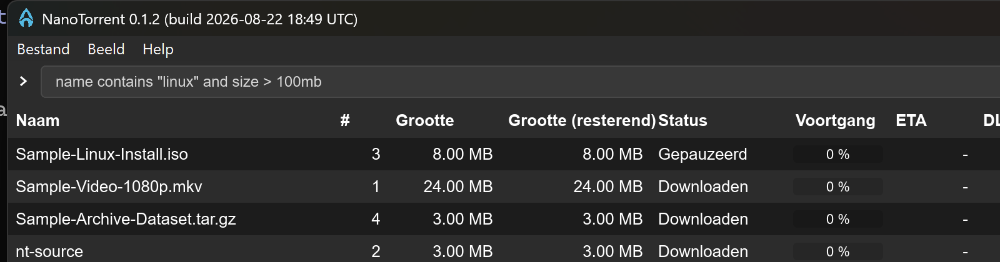
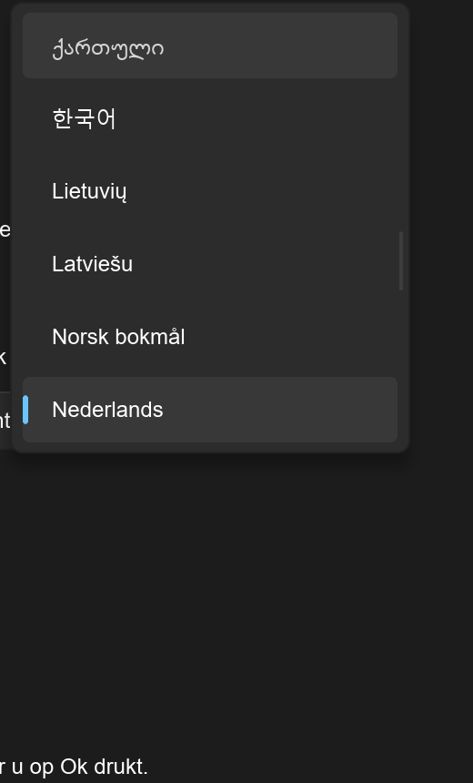
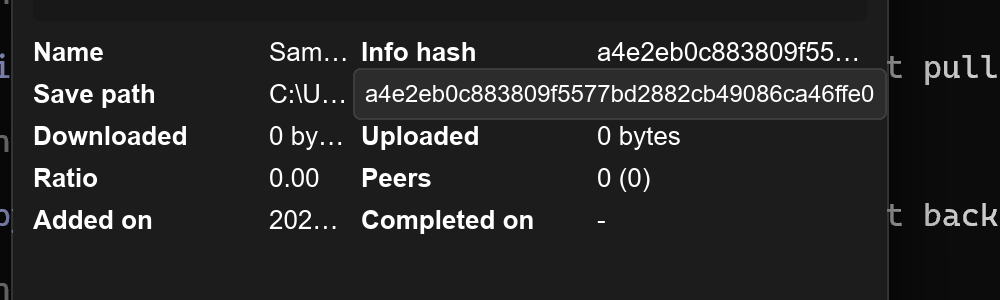
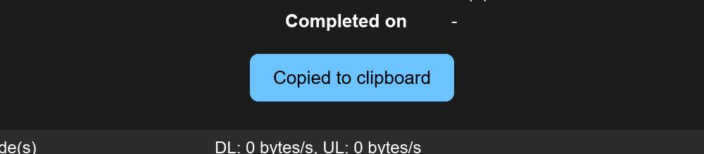
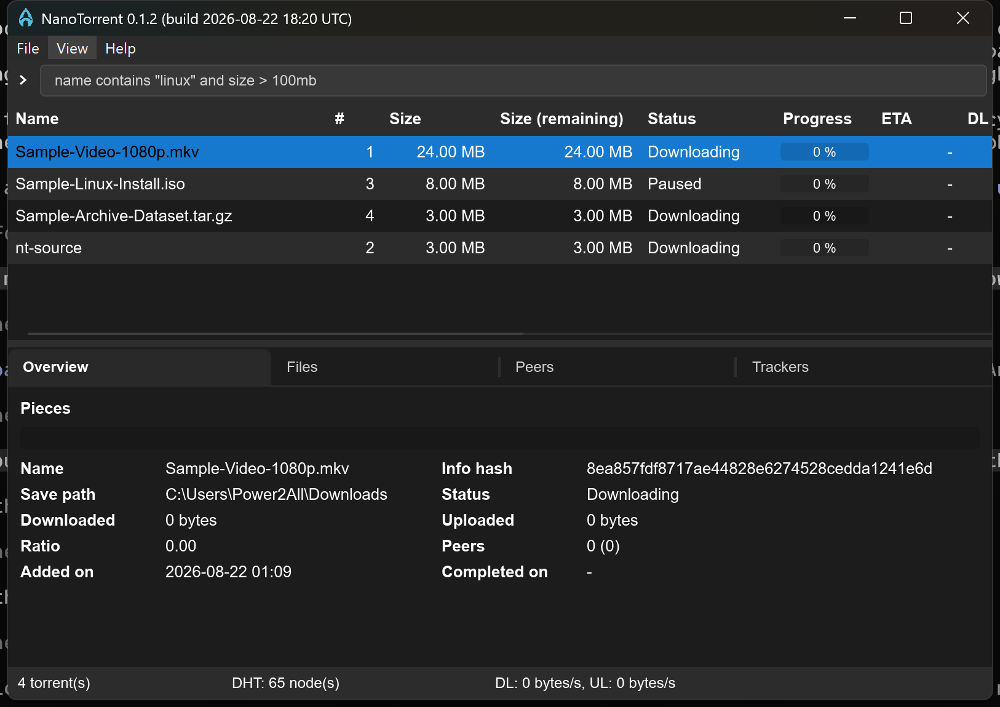
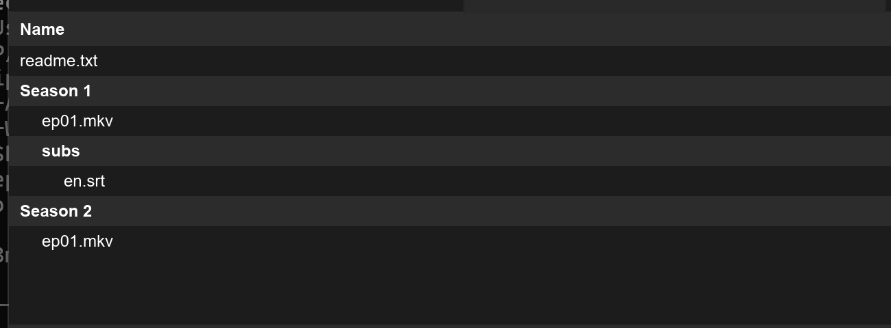
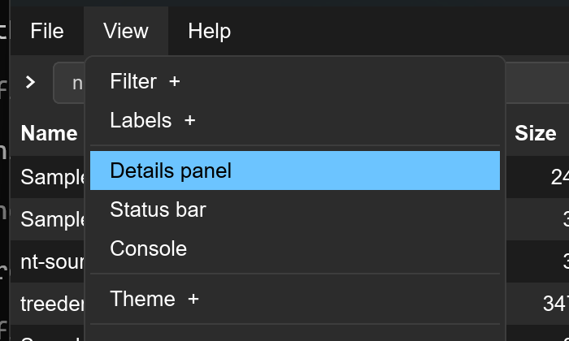
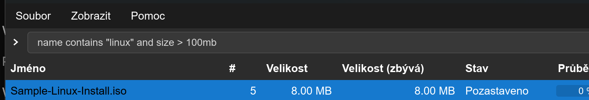
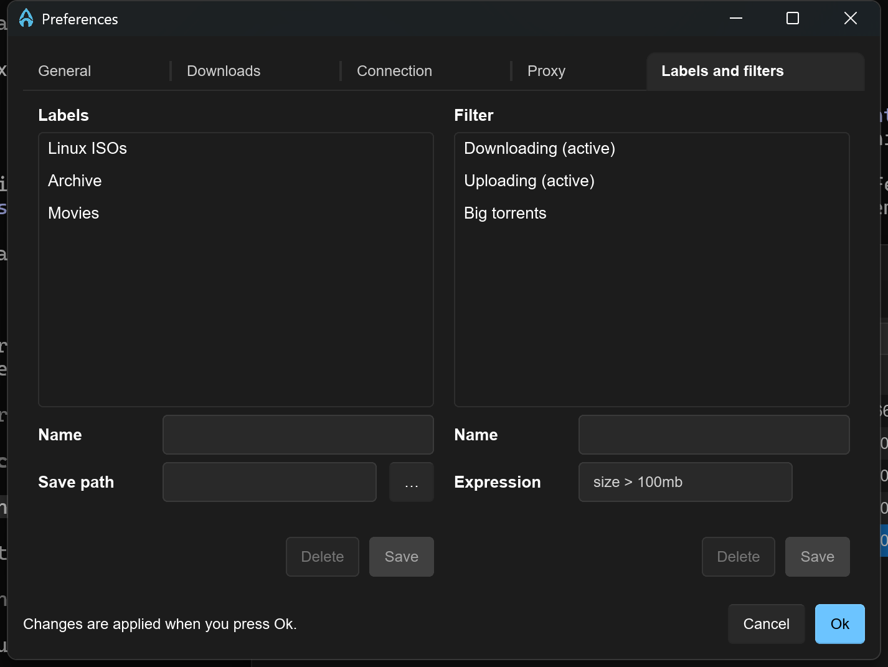
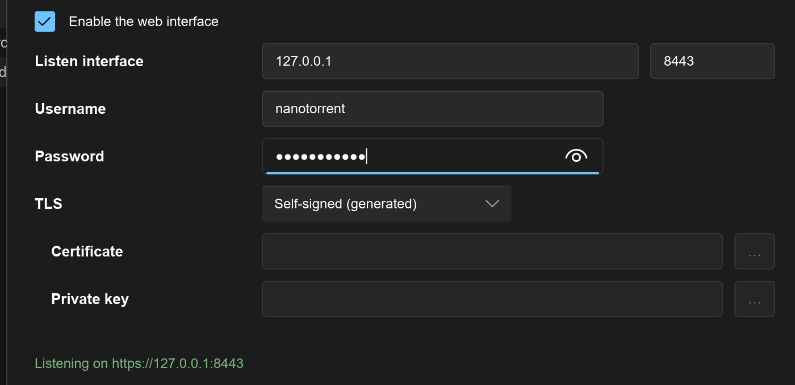

# Slint UI — filters, labels, console and theme

Captured from a release build against an isolated portable instance
(`C:\Test\nt-filters`) holding four synthetic torrents and two labels. Every
shot below is a real capture, not a mockup.

| | |
|---|---|
| `01-filters-menu.png` | View ▸ Filters, built from the `filter` table with a leading "None". The active entry carries a `✓` in its title — Slint's `MenuItem` has no checked state. |
| `02-filter-applied.png` | `size > 5mb` picked: four rows down to the two that match, applied on the click rather than on the next tick. The expression was edited in the database while the app was running, so this also shows the menu re-reading rather than caching. |
| `03-labels-menu.png` | View ▸ Labels, same shape. |
| `04-filter-and-label.png` | Filter **and** label together — one row survives both. Matches the composition order in `ui_native/mainwindow.rs`. |
| `05-console-valid.png` | The PQL console with a valid expression: white prompt, list filtered. |
| `06-console-invalid.png` | Half-typed `size > 5mb and`: red prompt, and the list holds the last valid result rather than emptying while you type. |
| `12-window-icons.png` | Every window carries the app icon, not just the main one - `icon: @image-url(...)` per Window. The exe's own icon comes from a separate Win32 resource in build.rs. |
| `11-context-menu-state.png` | Pause greyed on an already-paused torrent, off the first selected one - the rule `show_context_menu` applies in ui_native. |
| `08-tray-menu.png` | The notification-area icon and its menu, on Slint's built-in `SystemTrayIcon` - no extra crate. Left-click restores the window, right-click opens this. |
| `09-close-prompt.png` | Closing the window with no saved preference asks, the way ui_native does. "Remember my choice" writes `ui.close_action`, after which closing minimizes or exits silently. |
| `07-theme-menu.png` | View ▸ Theme, ticked the same way. Picking one sets `Palette.color-scheme` and persists `theme_id`. |

## Translation

Every visible string is `L.s("key")`, looked up against the same `lang/*.json`
keys ui_native uses. A global callback rather than one property per string:
there are ~130 of them.

Four things that are easy to get wrong here:

- **Globals are per top-level component, not per process.** Each dialog gets
  its own copy of `L`, and an unwired one returns `""` - which showed up as a
  Preferences window with no title at all. `wire_dialog_close` wires it on
  every dialog.
- **The JSON is authored for Win32 controls**: CRLF line endings and `&&` for a
  literal ampersand. `ui_string()` normalises both; without it a stray CR draws
  as a box and the file-association button reads "…files && magnet links".
- **Changing the language applies immediately** - no restart, unlike ui_native
  which prompts for one. A callback in a binding has no dependencies and would
  be evaluated once, so every lookup is written `L.s(L.revision, "key")`:
  reading `L.revision` is what makes the binding depend on something, and
  bumping it re-evaluates every caption. `Ui::tr` is a `RefCell` so the new
  translator is visible to closures built earlier. Column captions are computed
  in Rust rather than bound in markup, so `apply_language` recomputes those
  separately.
- **A typo in a key does not fail the build** - `i18n` humanizes anything it
  cannot find, so `L.s("cancle")` would quietly render "Cancle". The
  `every_key_used_in_markup_exists` test is the only thing that catches it.

Keys NanoTorrent needs that PicoTorrent never had were added to `en-US.json`
only. Other locales fall back to English per key, which is why Theme and "Ask
every time" are still English in the Dutch screenshot below - those keys do not
exist in `nl-NL.json`. That is the fallback working, not a bug.

## Language names

The picker shows endonyms - `Nederlands`, not `Dutch` and certainly not
`nl-NL`, which is what it used to show. The table lives in `translator.rs`;
ui_native gets the same list, so both dialogs improved.
`every_embedded_locale_has_an_endonym` fails if a `lang/*.json` is added
without one.

## Detail values: hover to read, right-click to copy

Every value in Overview, Files, Peers and Trackers (and the Add-torrent file
list) is a `DataText`. It elides when it does not fit, shows the whole value in
a tooltip **only when it is actually cut off** - `label.preferred-width >
root.width` - and copies it on a left click, confirmed by a toast.

The toast is drawn in-window, not through `core::toast` (which is WinRT and
Windows-only, meant for download-complete notifications). Repeated copies are
handled by a generation counter: without it an earlier toast's timer would
clear a later one early.

Two things worth knowing if you touch it:

- The tooltip uses Slint's `Tooltip` with **custom content**, not its `text`
  property. That property is a `styled-text` and needs `@markdown(...)`, which
  eats the underscores and asterisks that turn up in torrent names constantly.
- Copying goes through a Slint **global** (`Clip.copy`), not a callback
  threaded down through the list rows, which would need wiring at every use.

The clipboard itself is `copypasta` - already in the tree because Slint's winit
backend uses it for `TextInput`, so naming it directly cost no new crate. It
also gave the torrent context menu's **Copy info hash** and **Magnet link(s)**
their first working implementation; both had been logging instead of copying.

## Minimum window size

`min-width: 800px; min-height: 520px` on the main window. Below that the list
shows only the first couple of columns, and the splitter runs out of room - the
details panel will not go under 120px while the list keeps 220px. At the floor
everything is still usable: eight columns, both Overview columns and the status
bar.

## Modal dialogs

Three things together, and the order matters:

- Each dialog is made an **owned window** of the main one, so Windows hands
  activation back to it when the dialog is destroyed.
- `EnableWindow(owner, false)` while a dialog is up - what makes the title bar
  inert and clicking flash the dialog rather than raise the main window.
- A transparent `TouchArea` over the main window's content, so platforms
  without those two calls still get an inert window rather than nothing.

**The unblock must happen before the dialog hides.** Windows will not activate
a disabled window, so a dialog destroyed while its owner is still disabled
makes the shell give the foreground to the next window in the Z-order - another
application. That is why `dismiss()` and each dialog's `on_close_requested`
both re-enable first, rather than leaving it to the 100 ms poll, which only
remains as a safety net. Measured: with the unblock after the hide, all eight
close paths showed another application for 0-28 ms; with it before, none do.

## Files as a tree

`file_tree()` groups torrent paths into a directory tree and flattens it back
into rows carrying a depth - Slint has no tree widget, so the tree *is* the
indentation. Both file lists use it: the details Files tab and the Add-torrent
dialog.

The rows carry the index into the torrent's own file list, and folder rows
carry none. That matters: `only_files` indexes the torrent, not the model, so
counting model rows would shift every index by the number of folders above it.

## Peer flags

The same `res/flags/*.png` the Win32 list uses, decoded on first sight of a
country rather than all 252 up front. They are an **indexed palette with a
tRNS chunk**, so the decoder needs `png::Transformations::EXPAND` - without it
every flag comes back as palette indices and none of them decode.

## Menu bar

Hand-drawn, not Slint's `MenuBar`, and the dropdowns are drawn **in the
window** rather than as `PopupWindow`s. On Windows and macOS the winit backend
routes `MenuBar` through muda, whose popups take their colours from the OS
scheme and ignore `Palette` - and `supports_native_menu_bar` is hardcoded
`true` there with no runtime opt-out, so the only way to theme them is to draw
them. A `PopupWindow` grabs the pointer, so a click on another title only dismissed
the open menu and never reached the title underneath - moving along the bar did
nothing, which is not how a menu bar behaves anywhere. Drawn in-window there is
no grab, so hovering switches menus the way Windows does. A scrim `TouchArea`
below the bar catches outside clicks; it starts *below* the bar so the titles
stay live under it. The trade-off is that a dropdown cannot extend past the
window edge, which for a menu bar is not a real constraint.

Two sizing traps, both of which drew the panel invisibly at first:

- `height: <layout>.preferred-height` resolves to **0** for a layout inside an
  absolutely positioned `Rectangle`. Use `min-height`, which is computed
  bottom-up from the children.
- `absolute-position` did not give a usable window-relative offset here. The
  bar and its layout both sit at x=0 of the window, so the title's own `x` is
  already the offset the dropdown needs.

Submenus still expand in place rather than opening a nested popup.

**Lost with the native bar:** Alt-key access and OS keyboard navigation.

Two more layout traps found here, both of which drew a panel invisibly:

- A `VerticalLayout` reports **`min-height` 0 as soon as it has a conditional
  (`if`) child**. The File menu has none and worked; the View menu has three
  expanding submenus and did not. Each submenu is now a `Rectangle` with an
  explicitly computed height instead of an `if`.
- `preferred-height` is 0 for a layout inside an absolutely positioned
  `Rectangle`; `min-height` is the one to use.

`ui_string` also applies the Win32 ampersand rules now - `&&` is a literal
ampersand, a lone `&` marks an accelerator and is dropped. Without that the
drawn bar read "&File &View &Help".

## Column headers

The header cells are `Rectangle`s with an explicit width, with the `TouchArea`
inside - the same shape `Cell` uses for the rows. A `TouchArea` sizes to its
content, so putting the width on it made `width: parent.width - 12px` on the
caption circular and `overflow: elide` had nothing to elide against. Invisible
on Windows; on Linux, whose default font is wider, "Size (remaining)" ran
straight into "Status".

## Labels and filters tab

Two list-plus-editor panes that must stay structurally identical, or they stop
lining up. Two things that broke that:

- The right pane has a validation-message row the left had no counterpart to,
  so its list ended higher and the buttons below did not match. The left now
  has a matching spacer.
- A `LineEdit`'s preferred width counts its **placeholder**, so the long PQL
  example made the right pane wider than the left. That field uses a short
  example now - which also stopped it being truncated on screen.

## Web interface tab

The same settings `--webui-set` exposes, plus the password, which the CLI can
only take through a prompt.

- The **password is never stored** - `save_web` hashes it with Argon2id and
  writes only the hash. The field starts empty and its placeholder says whether
  one already exists, because the stored hash cannot be turned back into a
  password.
- The tab re-checks the three rules `webui::spawn` enforces at startup (a
  password is set, TLS is not off on a non-loopback address, a custom cert has
  both files) and shows why it would be refused. That is deliberate
  duplication: without it, Ok looks like it worked and the interface simply
  never appears.
- **Ok applies the change immediately.** `webui::restart` stops the running
  server and spawns a new one from the settings just saved, so enabling the
  interface does not need an app restart. The status line at the foot of the
  tab reports what actually happened - the address it is listening on, or the
  server's own refusal.
- `ServerHandle::stop` is async and the caller is the UI thread, which has no
  runtime, so `webui::stop` drives it on a throwaway one and **joins** the
  thread: respawning on the same port otherwise races the old listener.
- The dialog is kept alive between opens, so re-showing it reloads every tab.
  Without that it came back holding whatever was last typed - including a
  password still sitting in the field.

## Known limitations

- **The menu bar and its popups do not follow the app theme.** Slint renders
  them from the OS colour scheme, so with `theme_id` on the default `system`
  they agree with the rest of the window, but forcing Light on a dark desktop
  (or the reverse) leaves the menus in the OS scheme. Fixing it means drawing
  the menu bar in Slint, the way `ctx-popup` already replaces the native
  context menu.
- **The window frame follows the OS, not `theme_id`.** The Win32 UI calls
  `DwmSetWindowAttribute` (`ui_native/darkmode.rs`); the Slint window does not.
- **Menu strings are not translated.** The whole Slint UI is English-only so
  far, so "None" here is hardcoded rather than `tr.i18n("none")` — a lone
  translated entry among English items would read as a bug.
